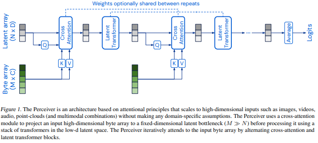

</img>

## Perceiver - Pytorch

Implementation of <a href="https://arxiv.org/abs/2103.03206">Perceiver</a>, General Perception with Iterative Attention, in Pytorch

<a href="https://www.youtube.com/watch?v=P_xeshTnPZg">Yannic Kilcher explanation!</a>

## Install

```bash
$ pip install perceiver-pytorch
```

## Usage

```python
import torch
from perceiver_pytorch import Perceiver

model = Perceiver(
    input_channels = 3,          # number of channels for each token of the input
    input_axis = 2,              # number of axis for input data (2 for images, 3 for video)
    num_freq_bands = 6,          # number of freq bands, with original value (2 * K + 1)
    max_freq = 10.,              # maximum frequency, hyperparameter depending on how fine the data is
    depth = 6,                   # depth of net. The shape of the final attention mechanism will be:
                                 #   depth * (cross attention -> self_per_cross_attn * self attention)
    num_latents = 256,           # number of latents, or induced set points, or centroids. different papers giving it different names
    latent_dim = 512,            # latent dimension
    cross_heads = 1,             # number of heads for cross attention. paper said 1
    latent_heads = 8,            # number of heads for latent self attention, 8
    cross_dim_head = 64,         # number of dimensions per cross attention head
    latent_dim_head = 64,        # number of dimensions per latent self attention head
    num_classes = 1000,          # output number of classes
    attn_dropout = 0.,
    ff_dropout = 0.,
    weight_tie_layers = False,   # whether to weight tie layers (optional, as indicated in the diagram)
    fourier_encode_data = True,  # whether to auto-fourier encode the data, using the input_axis given. defaults to True, but can be turned off if you are fourier encoding the data yourself
    self_per_cross_attn = 2      # number of self attention blocks per cross attention
)

img = torch.randn(1, 224, 224, 3) # 1 imagenet image, pixelized

model(img) # (1, 1000)
```

For the backbone of <a href="https://arxiv.org/abs/2107.14795">Perceiver IO</a>, the follow up paper that allows for flexible number of output sequence length, just import `PerceiverIO` instead

```python
import torch
from perceiver_pytorch import PerceiverIO

model = PerceiverIO(
    dim = 32,                    # dimension of sequence to be encoded
    queries_dim = 32,            # dimension of decoder queries
    logits_dim = 100,            # dimension of final logits
    depth = 6,                   # depth of net
    num_latents = 256,           # number of latents, or induced set points, or centroids. different papers giving it different names
    latent_dim = 512,            # latent dimension
    cross_heads = 1,             # number of heads for cross attention. paper said 1
    latent_heads = 8,            # number of heads for latent self attention, 8
    cross_dim_head = 64,         # number of dimensions per cross attention head
    latent_dim_head = 64,        # number of dimensions per latent self attention head
    weight_tie_layers = False,   # whether to weight tie layers (optional, as indicated in the diagram)
    seq_dropout_prob = 0.2       # fraction of the tokens from the input sequence to dropout (structured dropout, for saving compute and regularizing effects)
)

seq = torch.randn(1, 512, 32)
queries = torch.randn(128, 32)

logits = model(seq, queries = queries) # (1, 128, 100) - (batch, decoder seq, logits dim)
```

As an example, using PerceiverIO as a language model

```python
import torch
from perceiver_pytorch import PerceiverLM

model = PerceiverLM(
    num_tokens = 20000,          # number of tokens
    dim = 32,                    # dimension of sequence to be encoded
    depth = 6,                   # depth of net
    max_seq_len = 2048,          # maximum sequence length
    num_latents = 256,           # number of latents, or induced set points, or centroids. different papers giving it different names
    latent_dim = 512,            # latent dimension
    cross_heads = 1,             # number of heads for cross attention. paper said 1
    latent_heads = 8,            # number of heads for latent self attention, 8
    cross_dim_head = 64,         # number of dimensions per cross attention head
    latent_dim_head = 64,        # number of dimensions per latent self attention head
    weight_tie_layers = False    # whether to weight tie layers (optional, as indicated in the diagram)
)

seq = torch.randint(0, 20000, (1, 512))
mask = torch.ones(1, 512).bool()

logits = model(seq, mask = mask) # (1, 512, 20000)
```

## Experimental

I have also included a version of Perceiver that includes bottom-up (in addition to top-down) attention, using the same scheme as presented in the original <a href="https://arxiv.org/abs/1810.00825">Set Transformers</a> paper as the <a href="https://github.com/lucidrains/isab-pytorch">Induced Set Attention Block</a>.

You simply have to change the above import to

```python
from perceiver_pytorch.experimental import Perceiver
```

## Citations

```bibtex
@misc{jaegle2021perceiver,
    title   = {Perceiver: General Perception with Iterative Attention},
    author  = {Andrew Jaegle and Felix Gimeno and Andrew Brock and Andrew Zisserman and Oriol Vinyals and Joao Carreira},
    year    = {2021},
    eprint  = {2103.03206},
    archivePrefix = {arXiv},
    primaryClass = {cs.CV}
}
```

```bibtex
@misc{jaegle2021perceiver,
    title   = {Perceiver IO: A General Architecture for Structured Inputs & Outputs},
    author  = {Andrew Jaegle and Sebastian Borgeaud and Jean-Baptiste Alayrac and Carl Doersch and Catalin Ionescu and David Ding and Skanda Koppula and Andrew Brock and Evan Shelhamer and Olivier Hénaff and Matthew M. Botvinick and Andrew Zisserman and Oriol Vinyals and João Carreira},
    year    = {2021},
    eprint  = {2107.14795},
    archivePrefix = {arXiv},
    primaryClass = {cs.LG}
}
```
